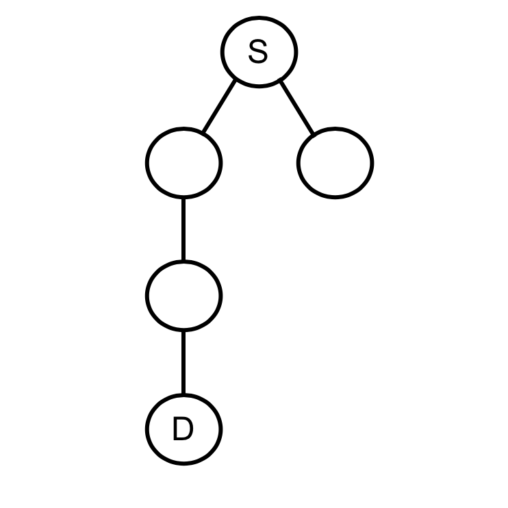
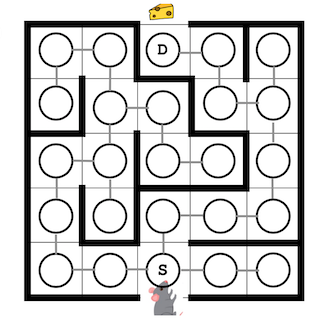

# CS435_project2
### Section 004 - Ryan Budhu

#### 1. Gonna Take My Horse To The Old Town Node
  + (a) `S A C B E F G K L D`

  + (b) 
    ```
    S = [A]
	C = [A]
	A = [S, C, B, E]
	A = [A, E]
	E = [B, A]
	F = [E, G]
	G = [F, K]
	K = [G, L]
	L = [K, D]
	D = [L]
	```
  + (c)  
  

#### 2. Boulevard of Broken Cheese
  + (a) 25 Nodes
  + (b) Adjacency lists of "touching" nodes
  + (c) Undirected, Acyclic, Connected, Unweighted
  + (d)  
  

#### 3. Traverse This Town
  + (a) [`Graph.py`](TraversThisTown/Graph.py)
  + (b) [`main.py`](TraversThisTown/main.py)
  + (c) [`main.py`](TraversThisTown/main.py)
  + (d) [`GraphSearch.py`](TraversThisTown/GraphSearch.py)
  + (e) [`GraphSearch.py`](TraversThisTown/GraphSearch.py)
  + (f) [`GraphSearch.py`](TraversThisTown/GraphSearch.py)
  + (g) [`GraphSearch.py`](TraversThisTown/GraphSearch.py)
  + (h) [`main.py`](TraversThisTown/main.py)
    * i. I ran into a `RecursionError: maximum recursion depth exceeded in comparison`.
	     The code needs to run n recursions (where n is number of nodes in the graph) when it is a LinkedList.
  + (i) [`main.py`](TraversThisTown/main.py)
    * i. Since there are no recursive calls made, there is no reason for the callstack to be overflowed.

#### 4. Thank U, Vertext
  + (a) A DAG is a connected graph where at least one node has 0 incoming nodes and at least one node has 0 outgoing nodes. 
        There are no cycles in a DAG. In the previous graph every connected node could traverse to and from each other.
        In a DAG they only move in one direction.
  + (b) [`DirectedGraph.py`](ThankUVertext/DirectedGraph.py)
  + (c) [`main.py`](ThankUVertext/main.py)
  + (d) [`TopSort.py`](ThankUVertext/TopSort.py)
  + (e) [`TopSort.py`](ThankUVertext/TopSort.py)